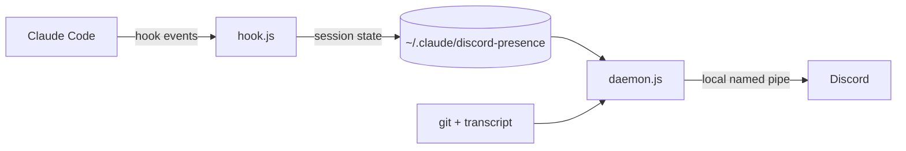

# Claude Discord Presence

[](https://github.com/goncalooliveira03/claude-discord-presence/actions/workflows/test.yml)


[](LICENSE)

Your Discord status shows what Claude Code is doing: the repo and branch you're in, what Claude is working on, and the model.

```
Playing Claude Code
📁 my-app · 🌿 main
✍️ Writing code · Opus 5
⏱ 12:04 elapsed
```

With the Claude desktop app open and no coding session running, your status reads "Playing Claude". Close the app and the activity disappears.

## Requirements

- Windows 10 or 11
- [Discord](https://discord.com/download) desktop app
- [Node.js](https://nodejs.org) 20 or newer
- [Git](https://git-scm.com)
- Claude Code (terminal, desktop app or IDE extension)

## Install

Open a terminal and run:

```bash
git clone https://github.com/goncalooliveira03/claude-discord-presence.git
cd claude-discord-presence
node install.js
```

Then restart the Claude Code sessions you have open. Your Discord profile updates the next time Claude does something.

Keep the folder where you cloned it, because the hooks point to it. If you move it, run `node install.js` again from the new place.

Discord only shows activities when **Share my activity** is on (User Settings → Activity Privacy).

## What your status shows

| When Claude is | Status |
|---|---|
| working on your prompt | 🤔 Thinking |
| editing files | ✍️ Writing code |
| reading or searching files | 📖 Reading code |
| running shell commands | ⚙️ Running commands |
| searching or fetching web pages | 🌐 Searching the web |
| running subagents | 🤖 Running agents |
| using another tool, such as an MCP server | 🛠️ Using tools |
| asking for permission | ✋ Waiting for approval |
| done and waiting for you | 💬 Waiting for input |

If you have several sessions open, Discord shows the one that did something most recently. A session that sits idle for 30 minutes drops out.

Anyone who can see your Discord profile can see your repo and branch names.

## Settings

Create `config.local.json` in the project folder. Its values override `config.json`, and `git pull` leaves it alone.

```json
{ "language": "pt" }
```

| Key | Default | Meaning |
|---|---|---|
| `language` | `en` | Status language: `en` or `pt` |
| `clientId` | this project's Discord app | ID of your own Discord application, if you want one |
| `largeImage` | `claude_icon_512` | Rich Presence art asset of that application |

Run `node install.js` after changing settings so the background process restarts.

## Update

```bash
git pull
node install.js
```

## Uninstall

```bash
node install.js --uninstall
```

This removes the hooks from `~/.claude/settings.json` (the previous file is kept as `settings.json.bak`), the startup entry and the local state. Delete the folder afterwards.

## How it works



- `install.js` registers `hook.js` for seven Claude Code hook events. The hooks run in the background, so Claude doesn't wait for them.
- `hook.js` writes a small JSON file per session with its current state.
- `daemon.js` starts without a window when you sign in to Windows. Every 5 seconds it picks the most recent session, reads the repo and branch from git and the model from the session transcript, and sends the activity to Discord through Discord's local IPC pipe.
- `presence.js` turns that data into the text you see. `node test.js` checks it.

The project has no npm dependencies and makes no network requests of its own.

## Troubleshooting

**Nothing shows up on Discord.** Check that Share my activity is on, and that you restarted Claude Code after installing.

**Still nothing.** Open `%USERPROFILE%\.claude\discord-presence\daemon.log`. You should see `connected to Discord`. Hook errors go to `hook-error.log` in the same folder.

**Old or missing icon.** Discord caches images. Wait a few minutes or press Ctrl+R in Discord.

## Disclaimer

This is a personal project, not affiliated with or endorsed by Anthropic or Discord. Claude is a trademark of Anthropic.

## License

[MIT](LICENSE)
